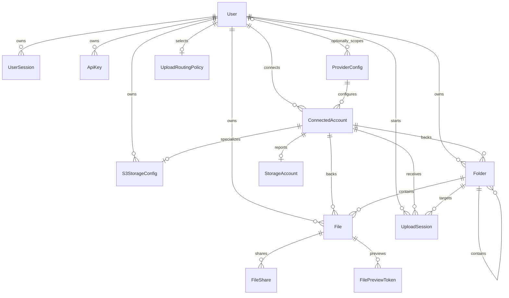
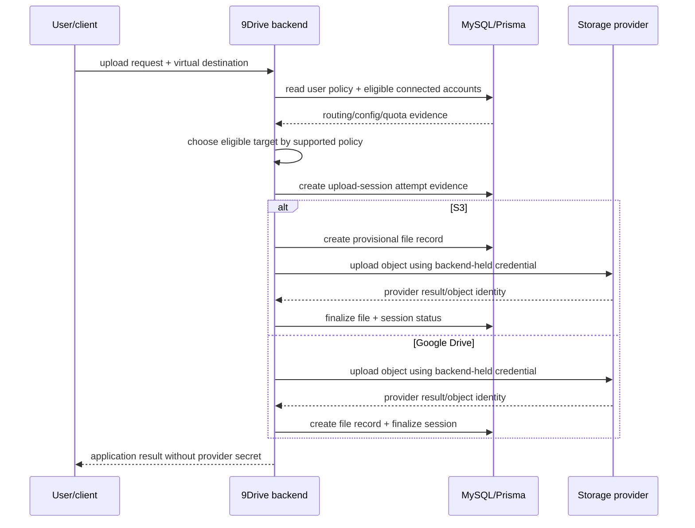

# 9Drive product and technical gap baseline

**Snapshot:** 2026-09-02  
**README-lane base:** `develop@fea4e4406c975b93d21a794c097e46fe56149989`  
**Audience:** operators, maintainers, security reviewers, and integrators

This ledger records the current fork-local product boundary, storage/account authority, data model, provenance, release state, and buyer-visible gaps. It is dated evidence rather than a substitute for fresh exact-head PR/check/release reads.

## Product responsibility

9Drive is a self-hosted storage gateway that lets one application user connect Google Drive and S3-compatible accounts, see storage capacity, organize files through a virtual folder model, and route uploads to an eligible backing account.

The application owns its user/session/API-key state, encrypted provider-credential records, virtual folder/file metadata, upload-routing policy, upload-session evidence, and audit records. It does **not** become the authority for Google/S3 object existence, provider quotas, provider credentials, provider availability, OAuth issuer behavior, or MySQL itself.

## Ubiquitous language and invariants

- **User:** 9Drive application identity that owns sessions, API keys, provider connections, virtual storage metadata, and routing policy.
- **Connected account:** a user-scoped provider identity for Google Drive or an S3-compatible service.
- **Provider configuration:** encrypted OAuth client configuration. It may be user-scoped or global (`user_id = NULL`); a seeded global configuration is not owned by an individual user.
- **Storage account:** synchronized quota/capacity evidence attached to one connected account; provider state remains externally authoritative.
- **Virtual folder:** 9Drive navigation metadata that may reference a provider folder but is not itself the provider's folder authority.
- **File record:** application metadata for a provider object, bound to provider and provider object identity.
- **Upload routing policy:** user-owned application policy selecting eligible backing accounts by the supported routing mode; it never manufactures provider capacity.
- **Upload session:** application-side evidence for an upload attempt and its selected backing account/folder/status.
- **Provider credential:** encrypted application-held integration material; never browser-facing authority.
- **External upload API key:** revocable application credential stored by hash rather than plaintext.

## Context Map

```text
Browser / API client
        |
        v
+-------------------------------+
| 9Drive                        |
| frontend + backend            |
| auth / virtual storage        |
| upload routing / metadata     |
+-------------------------------+
   |              |            |
   | Prisma       | adapters   | OAuth/API
   v              v            v
 MySQL       Google Drive   S3-compatible storage
                  |
                  v
          external provider truth
```

Google/S3 integrations are Anti-Corruption Layers: provider account/object/quota truth is translated into application records but remains externally authoritative. MySQL is the durable application persistence implementation behind Prisma.

## Core ERD

The current Prisma schema is MySQL-backed and includes the following core relationships. This diagram intentionally omits secondary audit/invite/state tables from the visual while preserving their authority in the schema. `ProviderConfig.userId` is nullable, so a configuration can be global rather than user-owned.



The source schema also contains OAuth state/handoff, file-sharing/preview, workspace invitation, and audit evidence. Database identifiers remain Prisma-mapped snake_case at the persistence boundary while TypeScript uses idiomatic field casing.

## Upload flow UML



Synchronous upload attempt evidence exists before provider completion; S3 additionally creates a provisional file record before its provider upload. A provider failure or unverifiable capacity/state must remain visible as integration failure rather than being rewritten as application-owned success.

Google Drive uploads remain private by provider default. The canonical writer removes the previous upload-time `anyone/writer` permission creation from both synchronous and resumable upload paths. Public sharing, when explicitly requested through a product sharing flow, must remain a separate authorized and revocable action rather than a storage side effect.

## Persistence migration and recovery boundary

Protected predecessor Compose configuration mounted `sqlite_data` at `/app/prisma` and pointed `DATABASE_URL` at `/app/prisma/dev.db`, while the checked-in Prisma schema and migration lock are MySQL. The canonical README lane aligns new installations with the MySQL schema, but it does **not** claim an automatic in-place migration for any legacy SQLite data that may exist.

Before changing an existing SQLite-based installation, the operator must preserve the exact legacy database bytes and digest while the legacy container/revision is still available. The new MySQL Compose topology must not be started under the assumption that it imports that file. The branch also makes `/system/backup` and `/system/restore` fail closed with explicit unsupported responses under non-file databases instead of interpreting a MySQL URL as a filesystem path. A validated SQLite-to-MySQL conversion plus MySQL backup/restore acceptance remains required before this is an in-place upgrade path.

## Provenance and licensing

GitHub metadata identifies `ContextualWisdomLab/9drive` as a fork of `zenhosta/9drive`. The fork diverged before upstream added its root Apache License 2.0 file; the canonical README lane restores that inherited upstream Apache-2.0 lineage and `Copyright 2026 Zenhosta` rather than inventing ContextualWisdomLab-exclusive rights.

Fresh upstream provenance confirms that current `zenhosta/9drive` still declares `"license": "ISC"` in `backend/package.json` after upstream commit `811d4a2137538b73abb43d195d7bf452e01b0c58` added the repository-level Apache-2.0 grant. This fork preserves the same inherited dual metadata. Apache-2.0 and ISC both permit commercial use; neither declaration is silently rewritten into the other. A future independently distributed backend package should retain the inherited ISC package declaration unless upstream provenance or an explicit rights-backed change establishes a different package grant. Third-party npm packages, Google APIs, S3 services, MySQL, container images, and external assets/services retain their own terms.

## Release and publication state

The ContextualWisdomLab fork currently has no GitHub Release. Upstream previews/releases are not fork release evidence. `docs/index.md` is only documentation source; no GitHub Pages publication is inferred from the file's presence.

## Gap register

| Priority | Gap | Evidence / risk | Required action | Status |
| --- | --- | --- | --- | --- |
| P0 | No immutable fork release / full release evidence | Fork release inventory is empty; current branch evidence is mutable | Establish one protected exact source revision with build/test/security, package/container integrity, SBOM/provenance, migration/backup/rollback evidence before publishing a fork release | **Open** |
| P0 | Legacy persistence migration and MySQL recovery are incomplete | Predecessor Compose named a SQLite file/volume while current Prisma schema is MySQL; no validated SQLite-to-MySQL converter or MySQL backup/restore acceptance exists | Keep MySQL Compose new-install-only, preserve legacy DB bytes before revision change, fail closed for file-only backup APIs on MySQL, then implement and verify conversion plus MySQL backup/restore/recovery before in-place upgrade claims | **In progress on #3; migration/recovery open** |
| P0 | Production identity/security boundary is not evidenced as deployment-ready | Local Compose is intentionally loopback-only; Google OAuth, TLS, secret provisioning, backups and provider credentials are deployment-owned | Define and test a production deployment profile with HTTPS, secret/KMS handling, OAuth callback/origin validation, least privilege, backup/restore and recovery acceptance without claiming certification | **Open** |
| P1 | Provider/app metadata reconciliation needs explicit correctness evidence | Google/S3 object/quota truth is external while application file/folder/quota records are durable | Add realistic integration/reconciliation tests for stale/deleted/moved provider objects, quota drift, partial upload, retry/idempotency and provider outage behavior | **Open** |
| P1 | Google uploads previously broadened provider ACL during storage | Synchronous and resumable paths created `anyone/writer` permissions as an upload side effect | Keep provider objects private by default; public sharing must be explicit, authorized, least-privilege and revocable | **Candidate repair on #3; requires exact-head verification** |
| P1 | Source development uses mutable npm install behavior in README | Current source guide uses `npm install`; reproducibility depends on package-lock discipline and exact Node/npm compatibility | Establish and document locked clean-install/toolchain contract (`npm ci` where supported), then bind CI/package evidence to it | **Open** |
| P1 | No canonical PRD/TRD/ADR/architecture decision graph | Product boundary is reconstructed from current code/schema/README rather than a maintained requirements/decision set | Add scoped PRD/architecture/ADR only when a product/security/data authority decision changes; keep this baseline as the interim durable authority map | **Open documentation gap** |
| P2 | Backend package distribution license is distinct from the repository grant | Upstream current source retains ISC in `backend/package.json` after adding root Apache-2.0 | Preserve both inherited declarations; if the backend is ever published independently, verify package artifact license/NOTICE scope against upstream provenance rather than changing metadata by assumption | **Known inherited boundary** |
| P2 | Public README/onboarding was stale and insecure | Prior landing mixed upstream detail with fork-local assumptions and invalid Compose/env defaults | Canonical PR #3 owns product-first README, safe templates, MySQL/Prisma alignment, loopback defaults, provenance, private-by-default uploads, and this ledger | **In progress on #3** |

## Current documentation integration lane

PR #3 is the canonical fork public-surface writer. It owns README/public landing, the restored inherited root license, safe environment templates, Compose truth fixes, upload permission hardening, fail-closed persistence-backup behavior, and this baseline. All exact-head workflow/review evidence must be reacquired after each mutation.

## Update rule

Update this ledger when protected fork behavior, database schema, provider authority, authentication/credential handling, licensing/provenance, release state, or a gap status changes. Open PR heads and check IDs are dated evidence only and must not be treated as permanent product truth.